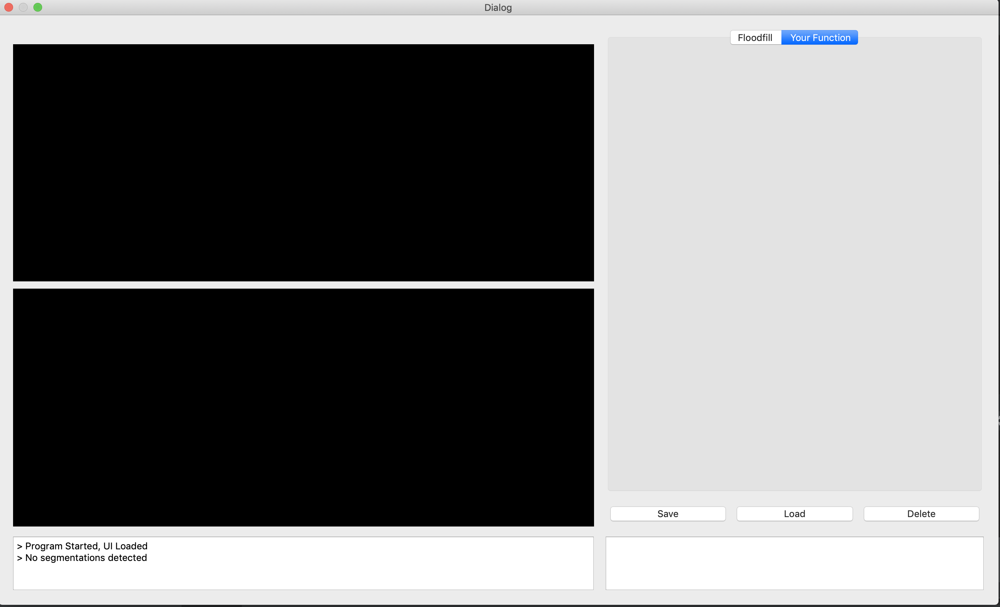
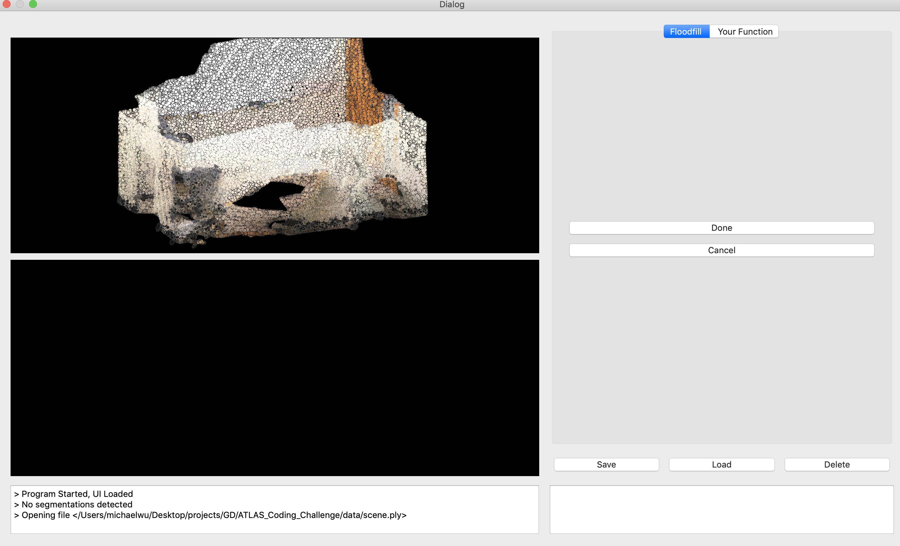
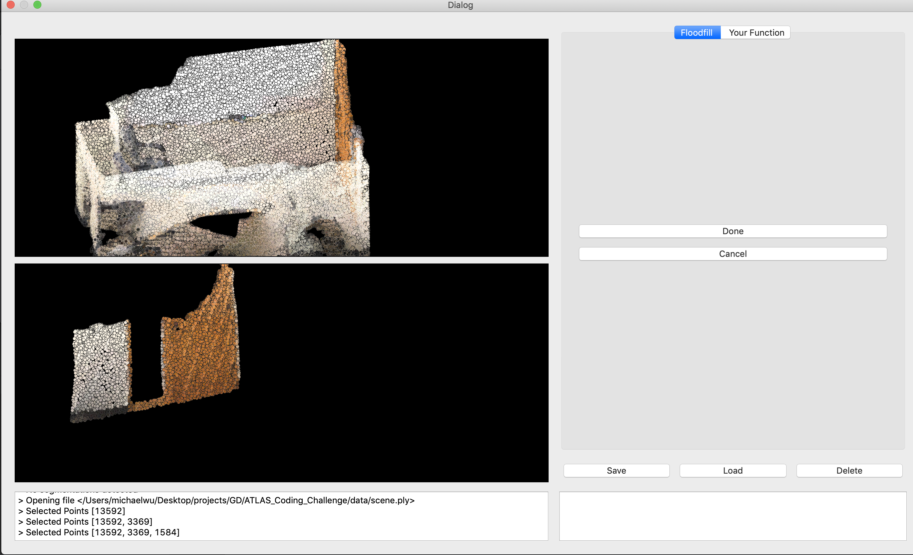

# ATLAS_Coding_Challenge
## I. Get Started
#### A. Set up environment
We use Conda as our environment management tool
1. `conda create -n env_name python=3.7`
2. `conda activate env_name`
3. `pip install -r requirements.txt` \
To see if everything is working properly, run
`python main.py` and the following window should pop up

#### B. Sample Usage
1. Run the program with `python main.py`.
2. click on the *Floodfill* tab
3. click on the *Load* button
4. Select `data/scene.ply`
5. You should see this screen

6. click on any three points on a wall, and then click *Done*
7. you should see something like this

## Your Task
1. Any interactions(buttons, textfields, etc) you decide to implement should be in the *Your Function* tab
2. Display the original pointcloud in the upper display box(the upper display box with the room in the Sample Usage section)
3. Display an arbitrary cropped out pointcloud in the lower display box(the lower display box with the wall in the Sample Usage section)

Stretch Goal:
1. In the Your Function tab, implement input fields that user can provide arbitrary X, Y, Z coordinates, and using those X,Y,Z coordinates, crop out the respective portion of the pointcloud. If any error occurs, write it in the `message_center` in the lower left corner
2. Implement function for saving and deleting. (Hint: saving is done for you, please see how we are doing it and make sure that you comply with the same schema)
